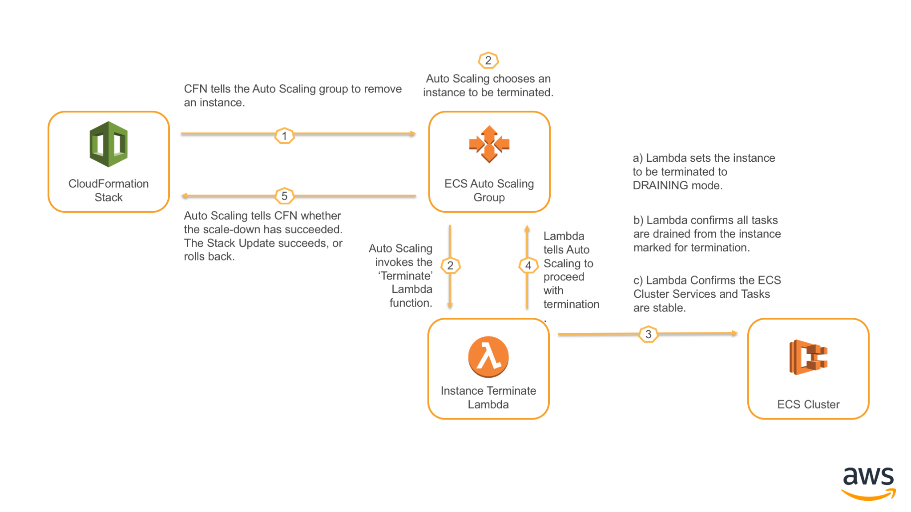
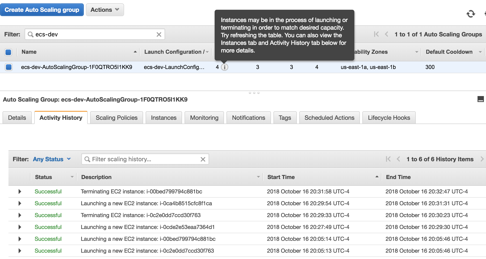
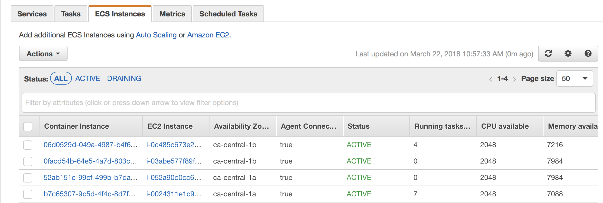
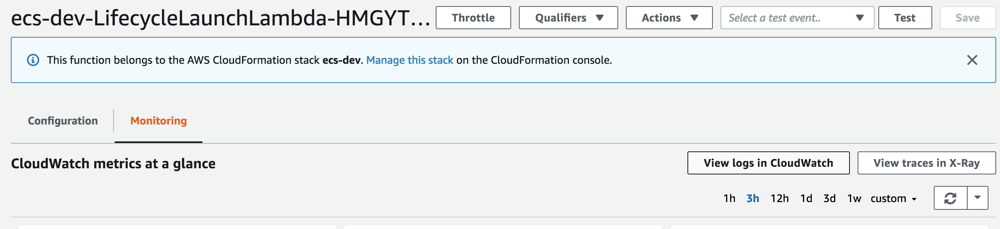
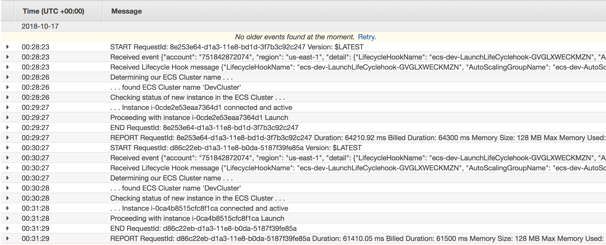

## ECS Cluster Manager

This project is meant to automate and simplify the lifecycle management of an ECS cluster.

## Technologies Used

### CloudFormation

CloudFormation is used to deploy the stack, and should be used for lifecycle management. Autoscaling groups, lambda functions, etc should not be edited directly. Instead the CloudFormation template should have an 'update' performed.

This will force resolution of the latest AMI, as well as provide an opportunity to change the size or instance type involved in the ECS cluster.

CloudFormation has rollback capabilities to return to the last known good state if errors are encountered so it is the recommended mechanism for management through the clusters lifecycle.

### Autoscaling

For ECS, the primary scaling and rollout mechanism is [autoscaling](https://aws.amazon.com/autoscaling/). Autoscaling allows you to define a desired state environment, and allow the autoscaling service to reach that desired state as necessary by launching / terminating instances.

When a new AMI has been baked, CloudFormation informs Autoscaling that it needs to replace the existing fleet of instances. This is controlled by an autoscaling [update policy](https://docs.aws.amazon.com/AWSCloudFormation/latest/UserGuide/aws-attribute-updatepolicy.html).

This solution will roll a single instance out to the ECS cluster, then drain, and terminate a single instance in response. This cycle continues until all instances in the ECS cluster have been replaced.

### Auto scaling Lifecycle Hooks

Auto scaling permits the use of a LifeCycle Hook. This is a 'bit of code' that executes when a scaling operation occurs. This solution uses a Lambda function that is informed when an instance is Launched, and when one is Terminated.

A lifecycle hook will inform AutoScaling whether it can proceed with the activity or if it should abandon it. In this case we assure the ECS Cluster remains healthy and all tasks have been redistributed before allowing AutoScaling to proceed.

The **Launch Lambda function** waits until the instance has fully joined the ECS Cluster. This is shown by the instance being marked 'ACTIVE' by the ECS control plane, and it's ECS agent status showing as connected. This means the new instance is ready to run tasks for the cluster.

The **Terminate Lambda function** waits until the instance has fully drained all running tasks. It also checks that all tasks, and services are in a stable state before allowing Autoscaling to terminate an instance. This assures the instance is truly idle, and the cluster stable before an instance is allowed to be removed.

Lifecycles also have a timeout. In this case it is 3600 seconds (1 hour) before autoscaling will give up. In that case the default activity is to Abandon the operation.

### CloudWatch Events

CloudWatch Events is a mechanism for watching calls made to the AWS API control plane, and then launching stuff in response. This is the mechanism used to launch the Lambda functions when a lifecycle event occurs. It's also the mechanism used to re-launch the Lambda function when it times out (Lambda maximum execution time is 15 minutes).

In this solution four CloudWatch Events are created. Two to pick up the initial scale-up event. Two more to pick up a continuation from the Lambda function.

### Systems Manager Parameter Store

[AWS Systems Manager Parameter Store] (https://docs.aws.amazon.com/systems-manager/latest/userguide/systems-manager-paramstore.html) provides secure, hierarchical storage for configuration data management and secrets management.

This solution relies on the AMI IDs stored in Parameter store. Given a naming standard of “*/ami/ecs/latest*” this will always resolve to the latest available AMI for ECS.

CloudFormation [now supports] (https://aws.amazon.com/blogs/mt/integrating-aws-cloudformation-with-aws-systems-manager-parameter-store/) using the values stored in EC2 Parameter store as inputs to CloudFormation templates. So the template can be simply passed a value “*/ami/ecs/latest*” and it will resolve that to the latest AMI.

### Lambda

The Lambda functions are used to handle the AutoScaling lifecycle hooks. They operate against the ECS cluster to assure it is healthy, and inform AutoScaling that it can proceed, or to Abandon its current operation.

The functions are invoked by CloudWatch Events in response to scaling operations so they are idle unless there are changes happening in the cluster.

They're written in python, and make use of the [boto3](https://boto3.readthedocs.io/en/latest/) SDK to communicate with the ECS cluster, and Autoscaling service.

## LifeCycle Overview

### General

All lifecycle actions for the ECS cluster should be performed through CloudFormation! This assures the environment remains in a consistent state and reflects the template contents / parameters at all times. 

The CloudFormation template has numerous parameters that allow control of the lifecycle of the cluster. The primary ones we're concerned with are the desired number of cluster nodes, and the AMI to use for the cluster.

As these values are changed, various actors are invoked to match the desired state (whats described in CloudFormation) with the actual state (how the ECS Cluster actually looks).

### Scaling a cluster out (Adding Nodes)


Above is an overview of what happens when a stack update occurs that increases the number of nodes in the ECS cluster.

Step 3 confirms that the newly launched instance has actually joined the ECS Cluster. It also confirms the node is marked ACTIVE, and has a connected ECS Agent. This step generally confirms the function of Docker, and the ECS Agent (which runs in Docker), as well as the ability to join the cluster and receive tasks.

The Lambda function in step 3 can be modified as desired to add more tests before considering the node healthy. The cluster join, Active status, and connected agent check should be considered the bare minimum.

### Scaling a cluster in (Removing Nodes)



Above is an overview of what happens when a stack update occurs that decreases the number of nodes in the ECS cluster.

The Lambda function in this phase is responsible for making sure the instance that's been marked for temrination leaves the cluster in a safe manner.

To do this the instance is marked in status DRAINING which tells ECS that it should evacuate all running tasks, and not schedule further tasks on that node.

Once the instance has drained all tasks, a final check executes that confirms all Tasks and Services are in a 'Ready' state. This is a safety mechanism that tells us that the tasks have re-balanced in the cluster successfully and safely before proceeding.

**NOTE:** Once an instance is marked for termination, there is no way to completely stop that from happening. A lifecycle response of 'ABANDON' does not actually prevent termination. The instance will be terminated, but we will wait for an hour before timing out and actually terminating to give the cluster time to settle.

### Updating the AMI of a Cluster (Rolling Update)

When a new AMI ID is found in the parameters of a Stack update, CloudFormation coordinates the equivelent of a Scale-out, Scale-in on an instance by instance basis.

Rolling Update Overview:

1. A new Launch Configuration is created using the new AMI ID.
2. The Autoscaling group is told to add one new instance using the new Launch Configuration. This executes the 'Adding Nodes' process as noted above.
3. Once the 'Adding Nodes' process has finished for the single new node with the new AMI, the 'Removing Nodes' process is started against the oldest instance with the old AMI ID.
4. Once the 'Removing Nodes' process is finished, Steps 2 and 3 are repeated until all nodes in the cluster have been replaced.
5. If an error is encountered during the rollout the new Launch Configuration is deleted, and the old one is put back in place.

# Deployment

## PreRequisites

### AMI ID Parameter
Create an AWS Systems Manager parameter where latest desired AMI will be stored.
Navigate to `AWS Systems Manager` -> `Parameter store` -> `Create parameter`.
In `Parameter details` input `/ami/ecs/latest` as `Name`, select `String` as `Type`. As example we will use latest ECS-Optimized AMI ID as parameter `Value`. You can find latest Linux ECS-Optimized AMI on this [page](https://docs.aws.amazon.com/AmazonECS/latest/developerguide/ecs-optimized_AMI.html) or by running this CLI command:

```bash
aws ssm get-parameters --names /aws/service/ecs/optimized-ami/amazon-linux/recommended --region us-east-1 --query "Parameters[].Value" --output text | jq .
```
Substitute `us-east-1` with your desired region.

### Lambda Functions

The Lambda functions are too large to embed in the CloudFormation template. Therefore they must be loaded into an S3 bucket before CloudFormation stack is created.

Assuming we're using an s3 bucket called `ecs-deployment` we would copy each Lambda function zip file as follows:

```bash
aws s3 cp lambda/ecs-lifecycle-hook-launch.zip s3://ecs-deployment
aws s3 cp lambda/ecs-lifecycle-hook-terminate.zip s3://ecs-deployment
```

We'll then refer to these when running our CloudFormation template later so CloudFormation knows where to find the Lambda Zips.

### Lambda Function Role

The Lambda functions that execute require read permission to EC2, and ECS to make decisions, then permission to submit a result or heartbeat to the AutoScaling Service.

Create new `LambdaECSScaling` IAM policy in your AWS account. Use the following JSON as policy body.

```json
{
    "Version": "2012-10-17",
    "Statement": [
        {
            "Effect": "Allow",
            "Action": [
                "autoscaling:CompleteLifecycleAction",
                "autoscaling:DescribeScalingActivities",
                "autoscaling:RecordLifecycleActionHeartbeat",
                "ecs:UpdateContainerInstancesState",
                "ecs:Describe*",
                "ecs:List*"
            ],
            "Resource": "*"
        }
    ]
}
```

Create new `LambdaECSScalingRole` IAM role, select `AWS Service` -> `Lambda` as Trusted Entity. Attach following permissions policies:

  - LambdaECSScaling
  - ReadOnlyAccess
  - AWSLambdaBasicExecutionRole 

### ECS Cluster Instance Profile

The ECS Cluster nodes need to have an instance profile attached that allows them to speak to the ECS Service. This profile can also contain any other permissions they would require (SSM for management and executing commands for example).

These are all AWS managed policies so we only need to add the role.
Create new `EcsInstanceRole` IAM role, select `AWS Service` -> `EC2` as Trusted Entity. Attach following permissions policies:

  - AmazonEC2RoleforSSM
  - AmazonEC2ContainerServiceforEC2Role
  - AWSLambdaBasicExecutionRole

The `AWSLambdaBasicExecutionRole` may look out of place, but this allows the instance to create new CloudWatch Logs groups. This permission facilities using CloudWatch Logs as the primary logging mechanism with ECS. This managed policy grants the required permissions without us needing to manage a custom role.

### CloudFormation Parameter File

I recommend using a parameter file for the CloudFormation template. This documents the desired parameters for the template. It is usually less error prone to do this versus using the console for inputting paramters.

There is a file called `blank_paramter_file.json` in the project. You can copy this file to something new and with a more meaninigful name. eg: `dev-cluster.json` then fill out the parameters.

The file looks like this:

```json
[
  {
    "ParameterKey": "EcsClusterName",
    "ParameterValue": ""
  }, 
  {
    "ParameterKey": "EcsAmiParameterKey",
    "ParameterValue": ""
  },
  {
    "ParameterKey": "IamRoleInstanceProfile",
    "ParameterValue": ""
  }, 
  {
    "ParameterKey": "EcsInstanceType",
    "ParameterValue": ""
  },
  {
    "ParameterKey": "EbsVolumeSize",
    "ParameterValue": ""
  }, 
  {
    "ParameterKey": "ClusterSize",
    "ParameterValue": ""
  },
  {
    "ParameterKey": "ClusterMaxSize",
    "ParameterValue": ""
  },
  {
    "ParameterKey": "KeyName",
    "ParameterValue": ""
  },
  {
    "ParameterKey": "SubnetIds",
    "ParameterValue": ""
  },
  {
    "ParameterKey": "SecurityGroupIds",
    "ParameterValue": ""
  },
  {
    "ParameterKey": "DeploymentS3Bucket",
    "ParameterValue": ""
  },
  {
    "ParameterKey": "LifecycleLaunchFunctionZip",
    "ParameterValue": ""
  },
  {
    "ParameterKey": "LifecycleTerminateFunctionZip",
    "ParameterValue": ""
  },
  {
    "ParameterKey": "LambdaFunctionRole",
    "ParameterValue": ""
  }
]
```

Let's review each parameter:

* `EcsClusterName`: is the name of the ECS Cluster to create.
* `EcsAmiParameterKey`: is the EC2 Parameter store that contains the AMI ID that should be used. This will default to `/ami/ecs/latest`.
* `IamRoleInstanceProfile`: This is the Name of the EC2 Instance profile used by the ECS cluster members. Discussed in the pre-requesite section.
* `EcsInstanceType`: Is the instance type to use for the cluster. Use whatever is appropriate for your workloads.
* `EbsVolumeSize`: Is the size of the Docker storage setup that is created [using LVM](https://docs.docker.com/storage/storagedriver/device-mapper-driver/). ECS typically defaults to 100GB.
* `ClusterSize`: Is the desired number of EC2 Instances for the cluster.
* `ClusterMaxSize`: This value should always be double the amount contained in `ClusterSize`. CloudFormation has no 'math' operators or I wouldn't prompt for this. This allows rolling updates to be performed safely by doubling the cluster size then contracting back.
* `KeyName`: Name of the EC2 keypair to place on the ECS Instance to support SSH.
* `SubnetIds`: A Comma Seperated List of Subnet IDs that the cluster should be allowed to launch instances into. These should map to at least 2 AZs for a resilient cluster. eg: `subnet-a70508df,subnet-e009eb89`.
* `SecurityGroupIds`: A Comma Seperated List of Security Group IDs that will be attached to each node. eg: `sg-bd9d1bd4,sg-ac9127dca` (a single value is fine).
* `DeploymentS3Bucket`: This is the bucket where our two Lambda Functions for scaleup/scaledown lifecycle hooks can be found.
* `LifecycleLaunchFunctionZip`: This is the full path within the `DeploymentS3Bucket` where the `ecs-lifecycle-hook-launch.zip` contents can be found.
* `LifecycleTerminateFunctionZip`: This is the full path within the `DeploymentS3Bucket` where the `ecs-lifecycle-hook-terminate.zip` contents can be found.
* `LambdaFunctionRole`: This is the Name of the role the Lambda functions above will use. Discussed in the pre-requesite section.

A completed parameter file would look like this:

```json
[
  {
    "ParameterKey": "EcsClusterName",
    "ParameterValue": "DevCluster"
  }, 
  {
    "ParameterKey": "EcsAmiParameterKey",
    "ParameterValue": "/ami/ecs/latest"
  },
  {
    "ParameterKey": "IamRoleInstanceProfile",
    "ParameterValue": "EcsInstanceRole"
  }, 
  {
    "ParameterKey": "EcsInstanceType",
    "ParameterValue": "m4.large"
  },
  {
    "ParameterKey": "EbsVolumeSize",
    "ParameterValue": "100"
  }, 
  {
    "ParameterKey": "ClusterSize",
    "ParameterValue": "2"
  },
  {
    "ParameterKey": "ClusterMaxSize",
    "ParameterValue": "4"
  },
  {
    "ParameterKey": "KeyName",
    "ParameterValue": "dev-cluster"
  },
  {
    "ParameterKey": "SubnetIds",
    "ParameterValue": "subnet-a70508df,subnet-e009eb89"
  },
  {
    "ParameterKey": "SecurityGroupIds",
    "ParameterValue": "sg-bd9d1bd4"
  },
  {
    "ParameterKey": "DeploymentS3Bucket",
    "ParameterValue": "ecs-deployment"
  },
  {
    "ParameterKey": "LifecycleLaunchFunctionZip",
    "ParameterValue": "ecs-lifecycle-hook-launch.zip"
  },
  {
    "ParameterKey": "LifecycleTerminateFunctionZip",
    "ParameterValue": "ecs-lifecycle-hook-terminate.zip"
  },
  {
    "ParameterKey": "LambdaFunctionRole",
    "ParameterValue": "LambdaECSScalingRole"
  }
]
```

### Deploying the template

Given the template, and the parameter file you can deploy the template using the AWS CLI (or the console as desired).

An example deploying through the CLI. This assumes we have a stack named `ecs-cluster.yaml` and a parameter file named `dev-cluster.json`. It also uses the `--profile` argument to assure the CLI assumes a role in the right account for deployment.

```bash
aws cloudformation create-stack \
  --stack-name ecs-dev \
  --template-body file://./ecs-cluster.yaml \
  --parameters file://./dev-cluster.json \
  --region us-east-1 \
  --profile devAdmin
```

### Lifecycle updates (new AMI)

When a new AMI is launched, EC2 parameter `/ami/ecs/latest` should reflect the update. To update ECS cluster we simply need to run a stack update without changing any parameters. CloudFormation evaluates the value stored by `/ami/ecs/latest` and if it has changed makes updates as appropriate.

```bash
aws cloudformation update-stack \
  --stack-name ecs-dev \
  --template-body file://./ecs-cluster.yaml \
  --parameters file://./dev-cluster.json \
  --region us-east-1 \
  --profile devAdmin
```

Of course if you want a specific AMI instead of latest, update the value for `EcsAmiParameterKey` to point to it (eg: `/ami/ecs/2018-03-12T17-28-11Z`).

### Lifecycle updates (scale in/out)

Lets assume we wanted to change the size of the cluster. We would modify our parameter file and adjust the `ClusterSize` / `ClusterMaxSize` accordingly. We'd save our parameter file, then run an update. This is very similar to command above except we're calling an `update-stack` instead of a `create-stack`.

```bash
aws cloudformation update-stack \
  --stack-name ecs-dev \
  --template-body file://./ecs-cluster.yaml \
  --parameters file://./dev-cluster.json \
  --region us-east-1 \
  --profile devAdmin
```

This could also be done via the CloudFormation web UI as desired!

## Supervising updates

I recommend that updates to the ECS cluster are supervised while they are being deployed. This assures the cluster remains stable. Under the majority of situations there will be no manual intervention required.

**(One)** Keep an eye on Auto Scaling activities (Service EC2 -> Auto Scaling Groups -> Checkmark the Autoscaling Group for that Cluster then click on the 'Activity History' tab.):



**(Two)** Keep an eye on the ECS Instances to assure new instances are joining / Draining instances are leaving (Service ECS -> Choose Cluster then choose the 'ECS Instances' tab.):



**(Three)** Lambda Function Logs will help troubleshoot things that aren't behaving as expected (Service Lambda -> Choose the 'LifeCycleLaunch' or 'LifeCycleTerminate' function -> Click on the Monitoring Tab -> Then click the 'Jump to Logs' button):



Expand the logs for the latest executions and see what's going on:



You are also able to cancel the stack-update while it is in progress, and rollback scale-in / scale-out / ami changes by updating the parameter files to older values, and re-running the stack updates.

In the event of a timeout or a lifecycle hook failure the stack will roll-back to the last good state by itself. You can see this happening in the 'Events' section of the Cloudformation stack.

## License

This library is licensed under the Apache 2.0 License. 